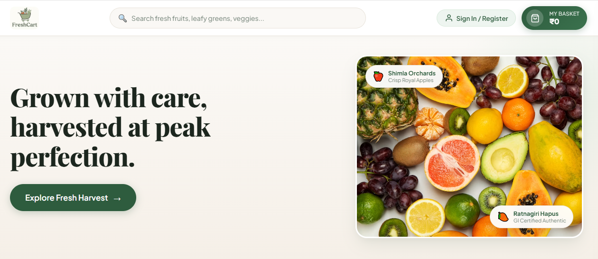
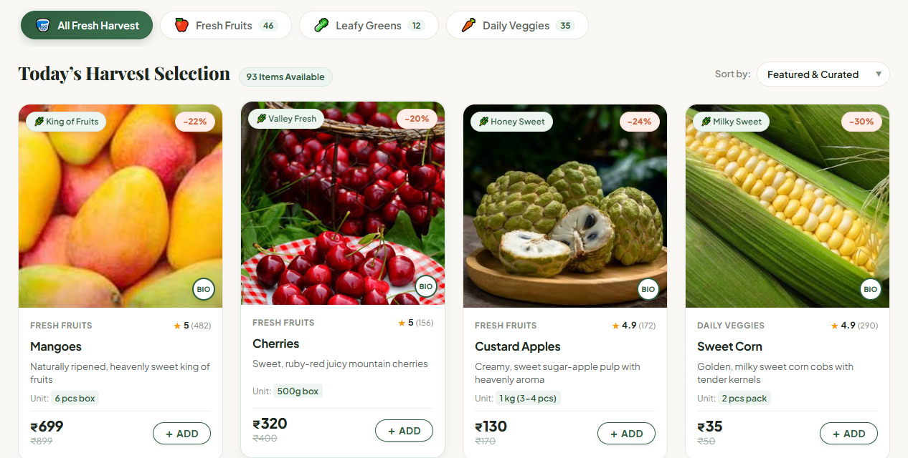
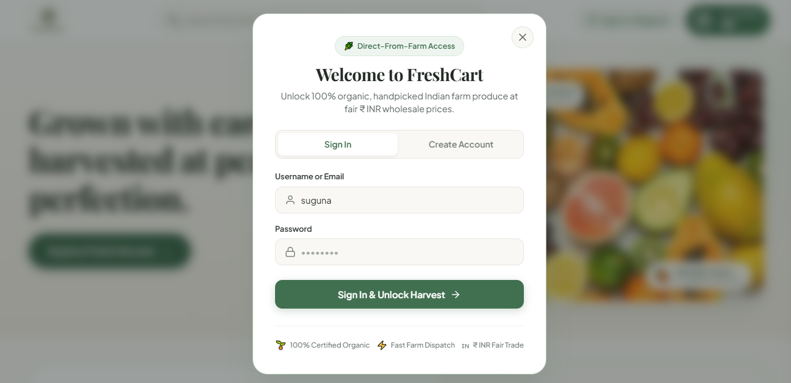

# 🌿 FreshCart — Farm-Fresh Organic E-Commerce Platform

> Production-grade, full-stack farm-to-table e-commerce platform specializing in 100% certified organic Indian fruits and vegetables.

---

## 📸 Screenshots & UI Preview

### 🌿 Landing Page & Hero Section
*Editorial botanical aesthetic featuring the sliding produce carousel, direct-from-farm guarantees, location selection, and the quick-access **MY BASKET** button.*



### 🧺 Harvest Selection & Produce Catalog (Member Unlocked)
*Full 93-produce dawn harvest catalog featuring dynamic category filters (46 Fruits, 12 Leafy Greens, 35 Daily Veggies), freshness tags, ₹ INR pricing, ratings, and instant cart steppers.*



### 🔐 1st-Time Visitor Sign-Up & Google 1-Click Authentication
*Clean modal featuring instant 1-Click Google Account Chooser (`select_account`), Email/Password registration, and quick membership access to unlock all 93 organic farm products.*



---

## 📋 Table of Contents
1. [📸 Screenshots & UI Preview](#-screenshots--ui-preview)
2. [✨ Key Features & User Flow](#-key-features--user-flow)
3. [🏛️ Architectural Overview](#-architectural-overview)
4. [🎨 Design System & Botanical Pastel Theme](#-design-system--botanical-pastel-theme)
5. [🛠️ Technology Stack](#-technology-stack)
6. [📂 Project Structure](#-project-structure)
7. [⚡ Prerequisites](#-prerequisites)
8. [🚀 Backend Setup (Django & PostgreSQL / Supabase)](#-backend-setup-django--postgresql--supabase)
9. [🅰️ Frontend Setup (Angular 18+ Standalone)](#-frontend-setup-angular-18-standalone)
10. [🔐 Authentication & Member Flow](#-authentication--member-flow)
11. [📊 Database Schema & Seed Data (93 Items)](#-database-schema--seed-data-93-items)
12. [🌐 REST API Endpoints](#-rest-api-endpoints)
13. [💡 Angular Signals & Cart Architecture](#-angular-signals--cart-architecture)

---

## ✨ Key Features & User Flow

- **1st-Time Visitor Sign-Up Requirement**:
  - When visiting FreshCart for the 1st time, users are invited to create an account or sign in to unlock and view the full 93-item dawn harvest catalog.
  - The landing page features a **Private Farm Gate** section explaining wholesale farm pricing, zero-chemical guarantees, and direct farmer sourcing.
  - Visitors can immediately sign up via standard **Email/Password** or native **1-Click Google Sign-In**.
  - Once signed up/signed in, all 93 organic produce items unlock instantly with real-time category filtering and search.
- **Conditional "MY BASKET" Visibility (Authenticated Members)**:
  - "My Basket" is kept hidden on the initial landing page for unauthenticated visitors to maintain a focused, minimal onboarding experience.
  - The moment a user registers or logs in, the **MY BASKET** button becomes visible in the top navigation header.
  - Displays real-time item count badges and live subtotal in Indian Rupees (`₹ INR`) as items are added from the catalog.
- **93 Authentic Organic Produce Items**:
  - **46 Fresh Fruits** (Apples, Ratnagiri Alphonso Mangoes, Sweet Strawberries, Apricots, Avocados, etc.)
  - **12 Leafy Greens** (Ooty Baby Spinach, Methi/Fenugreek, Hydroponic Coriander, Mint, Mustard Greens, etc.)
  - **35 Daily Veggies** (Desi Tomatoes, Sweet Potatoes, Nagpur Carrots, Green Peas, Broccoli, Sweet Corn, etc.)
- **Local Public Folder Assets with 2-Tier Fallback**:
  - All product images are served directly from Angular's `public/` directory (`/fruits/`, `/greens/`, `/veggies/`, `/logo.jpg`).
  - Circular containers include `(error)="onImageError($event)"` with a 2-tier fallback (`/logo.jpg` → dynamically generated SVG badge) so images never appear blank.
- **Supabase Cloud Database & PostgreSQL Support**:
  - Built-in `dj-database-url` integration enables seamless one-variable switching between local PostgreSQL and remote Supabase PostgreSQL via `DATABASE_URL`.
- **Farm Manager Admin Portal**:
  - Full CRUD operations: Create, update, delete produce, upload images, and manage customer orders.
  - Separate dedicated admin view with storefront preview toggle.

---

## 🏛️ Architectural Overview

FreshCart employs a decoupled, production-ready micro-monorepo architecture:

- **Frontend (`:4200`)**: Angular 18+ with standalone components, native Angular Signals reactivity, Firebase Authentication, and custom botanical SCSS design system.
- **Backend (`:8000`)**: Django 5.x with Django REST Framework (DRF), `django-cors-headers`, `dj-database-url`, and `SafeTokenAuthentication`.
- **Database**: PostgreSQL (local `freshcart_db` or cloud-hosted Supabase PostgreSQL).
- **Localization**: Indian Rupee (`₹ INR`) currency formatting throughout, Indian organic produce varieties, and metro delivery slots.

```
   ┌────────────────────────────────┐         REST JSON API
   │   Angular 18+ Frontend         │ ◄──────────────────────────► ┌──────────────────────────────┐
   │   • Standalone Components      │     http://localhost:8000/   │   Django 5 REST Backend      │
   │   • Angular Signals (Cart)     │                              │   • DRF ModelViewSets        │
   │   • Firebase 1-Click Auth      │                              │   • SafeTokenAuthentication  │
   │   • Botanical Pastel System    │                              │   • dj-database-url Support  │
   └────────────────────────────────┘                              └──────────────┬───────────────┘
                                                                                  │ psycopg2 / SSL
                                                                                  ▼
                                                                   ┌──────────────────────────────┐
                                                                   │   PostgreSQL / Supabase      │
                                                                   │   • 93 Produce Items         │
                                                                   │   • 3 Categories             │
                                                                   └──────────────────────────────┘
```

---

## 🎨 Design System & Botanical Pastel Theme

| Token / Layer | Hex Value | Role & Usage |
| :--- | :--- | :--- |
| **Canvas Background** | `#FAF8F5` | Warm oat milk / cream canvas for clean readability |
| **Surface Cards** | `#FFFFFF` | Elevated produce cards with soft ambient shadow |
| **Primary Botanical** | `#2E5C3E` / `#417050` | Forest & sage green for primary actions & organic badges |
| **Sage Light Accent** | `#EEF5F0` | Pill background, badge background, and active states |
| **Sage Border** | `#D8EADB` | Subtle border around pills, inputs, and delivery meters |
| **Peach Blush** | `#FDEEE9` / `#C86842` | Discount badges, notifications, and secondary highlights |
| **Morning Lemon** | `#FEF8EB` / `#9E7418` | Free delivery threshold progress meter alert & guarantees |
| **Editorial Headings**| `Playfair Display` | Editorial serif typography for headings |
| **Geometric Body** | `Plus Jakarta Sans` | Modern geometric sans-serif for UI, numbers, and tags |

---

## 🛠️ Technology Stack

- **Frontend**:
  - Angular 18+ (Standalone Components, Signals, `computed`, `effect`)
  - Firebase Authentication (`signInWithPopup`, `GoogleAuthProvider`, `onAuthStateChanged`)
  - SCSS Design Tokens & Responsive Grid
- **Backend**:
  - Python 3.12+ & Django 5.x
  - Django REST Framework (DRF)
  - `django-cors-headers` & `django-filter`
  - `dj-database-url` for Supabase PostgreSQL
- **Database**:
  - PostgreSQL 14+ / Supabase Cloud PostgreSQL

---

## 📂 Project Structure

```
FreshCart/
├── backend/
│   ├── freshcart_core/
│   │   ├── settings.py           # DB (Postgres/Supabase), CORS, DRF, & SafeTokenAuth
│   │   ├── urls.py               # API route definitions
│   │   └── wsgi.py / asgi.py
│   ├── store/
│   │   ├── authentication.py     # SafeTokenAuthentication (graceful fallback)
│   │   ├── models.py             # Category, Product, Order, OrderItem
│   │   ├── serializers.py        # DRF serializers
│   │   ├── views.py              # CategoryViewSet, ProductViewSet, OrderViewSet
│   │   ├── auth_views.py         # Django DRF token auth endpoints
│   │   └── management/
│   │       └── commands/
│   │           └── seed_data.py  # Populates 93 items across 3 categories
│   ├── manage.py
│   └── requirements.txt
├── frontend/
│   ├── public/                   # Local static assets served at root /
│   │   ├── fruits/               # 46 fruit images
│   │   ├── greens/               # 12 leafy green images
│   │   ├── veggies/              # 35 daily vegetable images
│   │   └── logo.jpg              # Brand storefront logo & fallback
│   ├── src/
│   │   ├── environments/         # environment.ts & environment.prod.ts
│   │   ├── styles.scss           # Global botanical theme & viewport confinement
│   │   └── app/
│   │       ├── app.ts / .html    # Shell, membership gate & "MY BASKET" bindings
│   │       ├── services/
│   │       │   ├── api.service.ts    # Centralized HTTP API & fallbacks
│   │       │   ├── auth.service.ts   # Firebase Auth & Signals state
│   │       │   └── cart.service.ts   # Reactive cart & ₹299 free delivery meter
│   │       └── components/
│   │           ├── navbar/           # Header with prominent "MY BASKET ₹0" button
│   │           ├── hero-banner/      # Carousel, Explore CTA & Hero Basket button
│   │           ├── product-grid/     # 93-item grid, filters, sorting & error fallbacks
│   │           ├── product-card/     # Image fallback, steppers, BIO tag
│   │           ├── cart-drawer/      # Slide-over cart, delivery progress meter
│   │           ├── checkout-modal/   # Guest & member checkout with slots
│   │           ├── auth-modal/       # 1-Click Google chooser & sign-up tabs
│   │           └── admin-portal/     # Full CRUD management
│   ├── package.json
│   └── angular.json
└── README.md
```

---

## ⚡ Prerequisites

- **Node.js**: v18+ & npm
- **Python**: 3.10+
- **PostgreSQL**: Local 14+ or Supabase Cloud instance

---

## 🚀 Backend Setup (Django & PostgreSQL / Supabase)

### 1. Configure Environment
In `backend/.env`:
```env
DEBUG=True
SECRET_KEY=django-insecure-freshcart-organic-super-secret-key-2026-prod

# Option A: Local PostgreSQL
DB_NAME=freshcart_db
DB_USER=postgres
DB_PASSWORD=root
DB_HOST=localhost
DB_PORT=5432

# Option B: Supabase Cloud PostgreSQL (Uncomment to use Supabase)
# DATABASE_URL=postgresql://postgres:[YOUR-PASSWORD]@[YOUR-PROJECT-REF].supabase.co:5432/postgres

CORS_ALLOWED_ORIGINS=http://localhost:4200,http://127.0.0.1:4200
```

### 2. Install Dependencies & Run Migrations
```bash
cd backend
python -m pip install -r requirements.txt
python manage.py migrate
```

### 3. Seed 93 Farm-Fresh Produce Items
```bash
python manage.py seed_data
```
*Output: Successfully seeds 3 categories (Fresh Fruits, Leafy Greens, Daily Veggies) and all 93 produce items with local public image paths.*

### 4. Start the Django Server
```bash
python manage.py runserver 127.0.0.1:8000
```
- API Base URL: `http://127.0.0.1:8000/api/`
- Django Admin: `http://127.0.0.1:8000/admin/`

---

## 🅰️ Frontend Setup (Angular 18+ Standalone)

### 1. Install NPM Dependencies
```bash
cd frontend
npm install
```

### 2. Start Angular Development Server
```bash
npm start
# Server runs on http://localhost:4200/
```

---

## 🔐 Authentication & Member Flow

1. **1st-Time Visitors**:
   - Greeted on the landing page with the **Private Farm Gate** section inviting them to sign up.
   - Welcomed with the sign-up modal (`openAuthModal('register')`) to create their free account.
2. **Instant 1-Click Google Sign-In**:
   - Powered by Firebase `signInWithPopup(auth, provider)` configured with:
     ```typescript
     provider.setCustomParameters({ prompt: 'select_account' });
     ```
   - Instantly opens the native Google account selection sheet.
3. **Unlocked Catalog**:
   - Upon signing up or signing in, the storefront immediately renders all 93 items.
4. **Permanent Basket Access**:
   - The **MY BASKET** button in the header and hero banner remains active throughout the experience.

---

## 📊 Database Schema & Seed Data (93 Items)

- **`Category`**:
  - `name`: Category Title
  - `slug`: `fruits`, `greens`, `veggies`
  - `icon`: `🍎`, `🥬`, `🥕`
- **`Product`**:
  - `category`: Category ForeignKey
  - `name`: Produce title (e.g., *Apples, Ratnagiri Alphonso Mangoes, Ooty Baby Spinach, Desi Tomatoes*)
  - `price` & `original_price`: Decimal in ₹ INR
  - `unit`: Quantity specification (e.g., `1 kg`, `250g bunch`, `6 pcs box`)
  - `image_url`: Root path pointing to local public assets (e.g. `/fruits/apples.jpg`)
  - `stock_quantity`, `is_organic`, `freshness_tag`, `rating`

---

## 🌐 REST API Endpoints

| Method | Endpoint | Description | Auth |
| :--- | :--- | :--- | :--- |
| `GET` | `/api/categories/` | List categories with product counts | Public |
| `GET` | `/api/products/` | List all 93 produce items (supports `?category=veggies`, `?search=tomato`) | Public / Members |
| `GET` | `/api/products/<id>/` | Retrieve specific product details | Public |
| `POST` | `/api/products/` | Create new produce item | Admin |
| `PATCH`| `/api/products/<id>/` | Update produce item | Admin |
| `DELETE`| `/api/products/<id>/` | Remove produce item | Admin |
| `POST` | `/api/orders/` | Place order with atomic stock deduction | Public / Members |
| `GET` | `/api/orders/track/<order_number>/` | Track order by reference code | Public |

---

## 💡 Angular Signals & Cart Architecture

The state is managed reactively via Angular Signals in `CartService`:

- **Signals**:
  - `cartItems`: Reactive list of items in the customer basket.
  - `isCartOpen`: Controls the slide-over cart drawer.
  - `activeCategory`: Active tab filter (`all`, `fruits`, `greens`, `veggies`).
  - `searchQuery`: Live text search query.
- **Computed Signals**:
  - `totalItemCount`: Sum of item quantities.
  - `subtotal`: Total cost of items in ₹ INR.
  - `deliveryFee`: Free (`₹0.00`) when `subtotal >= ₹299`, else `₹40.00`.
  - `grandTotal`: Total amount (`subtotal + deliveryFee`).
  - `deliveryProgress`: Reactive progress percentage and amount remaining toward free delivery.

---

## 🛡️ License
MIT License. Built for organic farm collectives and modern Indian households.
